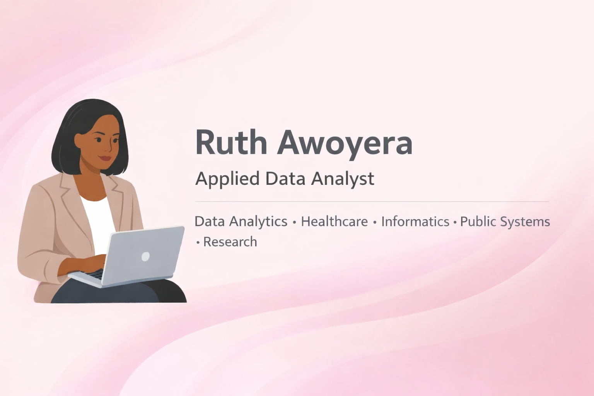

### Hi, I’m Ruth 👋🏽  
Applied Data Analyst working at the intersection of **healthcare, nonprofit, and public systems**.

I analyze messy, real-world data to support **decision-making, strategy, and systems improvement**.

---

### 🔎 Snapshot
- **Domains:** Healthcare, Public Sector, Nonprofit  
- **Strengths:** Data cleaning, systems analysis, stakeholder-facing insights  
- **Tools:** Python, SQL, Tableau / Power BI  
- **Focus:** Turning complex data into decisions

---

### 🧠 How I Think About Data
I approach analytics as a **decision support tool**, not just a technical exercise.

- I start with *what decision needs to be made*  
- I analyze patterns across **people, processes, and systems**  
- I prioritize clarity, context, and stakeholder usability over over-engineering  

My work often sits between technical teams, program staff, and leadership.

---

### 🛠 Tools I Use
- Python (Pandas, NumPy)  
- SQL (joins, aggregation, comparative analysis)  
- Data cleaning & exploratory data analysis (EDA)  
- Dashboards & data storytelling (Tableau / Power BI)  
- Research framing & insight translation  

---

### 🧩 Background & Experience
- CRM management and analytics in **healthcare and nonprofit settings**  
- Project management supporting **cross-functional initiatives**  
- Research experience translating open-ended questions into measurable insights  
- Collaboration with **clinical, operations, program, and leadership teams**  
- Comfort working with incomplete, messy, and operational data  
---

### 📊 Selected Projects  
*A focused portfolio demonstrating range across people, systems, and technology.*

**Exploratory Analysis of Engagement & Value Patterns** *(In Progress)*  
Behavioral CRM-style analysis focused on cleaning, feature engineering, and identifying engagement patterns and value indicators in real-world data.

**SQL-Based Analysis of County-Level Health Outcomes** *(Planned)*  
County-level public health analysis using SQL to examine disparities in outcomes relative to access, demographics, and system performance.

**Health IT Dashboard: Insights from Wearable Health Data** *(Planned)*  
Executive-style dashboard translating wearable health and fitness metrics into system-level insights relevant to preventive care and digital health.

---

### 🔗 Connect
- LinkedIn:[ https://www.linkedin.com/in/ruthawoyera/](url)
